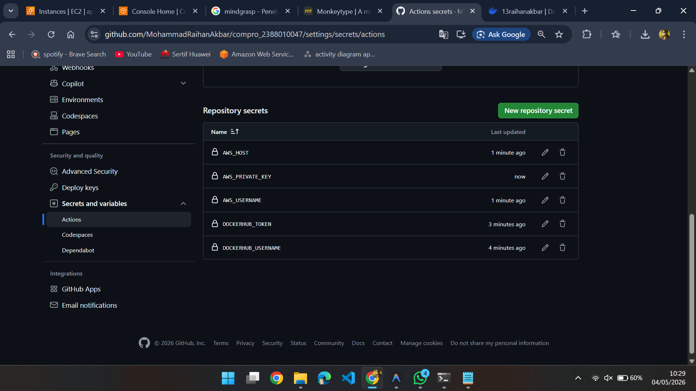
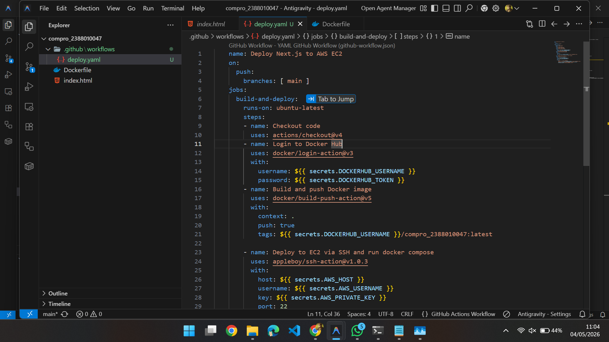
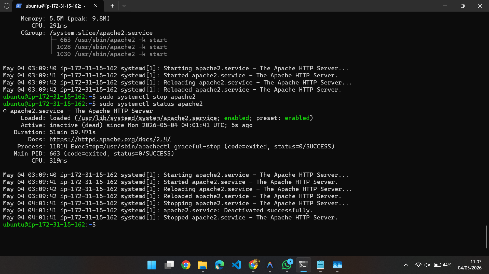
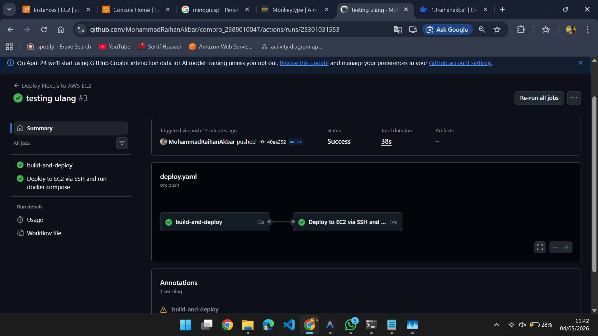

# Modernisasi Teknologi CI/CD

## Setup AWS Secret di Github
- Buka github repositories compro_nim klalu ke setting trus ke secrets and variables -> Actions

1. KLIK -> New repository secret
    - Name = DOCKERHUB_USERNAME
    - Value = Username akun dockerhub

2. KLIK -> New repository secret
    - Name = DOCKERHUB_TOKEN
    - Value = Token access docker hub

3. KLIK -> New repository secret
    - Name = AWS_HOST
    - Value = IP Address EC2

4. KLIK -> New repository secret
    - Name = AWS_USERNAME
    - Value = ubuntu

5. KLIK -> New repository secret
    - Name = AWS_PRIVATE_KEY
    - Value = [File Key)

## Mengedit file Pipeline di github
1. buka projek compro_nim
buat folder baru .github -> buat folder worksflow -> buat file deploy.yaml
isi file deploy.yaml dengan kode sebagai berikut :

name: Deploy Next.js to AWS EC2
    on:
      push:
        branches: [ main ]
    jobs:
      build-and-deploy:
        runs-on: ubuntu-latest
        steps:
        - name: Checkout code
          uses: actions/checkout@v4
        - name: Login to Docker Hub
          uses: docker/login-action@v3
          with:
            username: ${{ secrets.DOCKERHUB_USERNAME }}
            password: ${{ secrets.DOCKERHUB_TOKEN }}
        - name: Build and push Docker image
          uses: docker/build-push-action@v5
          with:
            context: .
            push: true
            tags: ${{ secrets.DOCKERHUB_USERNAME }}/compro_2388010047:latest

        - name: Deploy to EC2 via SSH and run docker compose 
          uses: appleboy/ssh-action@v1.0.3
          with:
            host: ${{ secrets.AWS_HOST }}
            username: ${{ secrets.AWS_USERNAME }}
            key: ${{ secrets.AWS_PRIVATE_KEY }}
            port: 22
            script: |
            docker rm -f compro_2388010047
            docker pull ${{ secrets.DOCKERHUB_USERNAME }}/compro_2388010047:latest
            docker run -d --name compro_2388010047 -p 80:80 ${{ secrets.DOCKERHUB_USERNAME }}/compro_2388010047:latest
``
        

2. disable apache2 sebelumnya
    sudo systemctl disable apache2
    sudo systemctl stop apache2
    pastikan sudah sudo usermod -aG docker ubuntu
    
    

3. Commit dan push file deploy.yaml
    - klik repositories compro_2388010047
    - klik Actions
    - pilih deploy.yaml
    - klik commit changes

    

    
