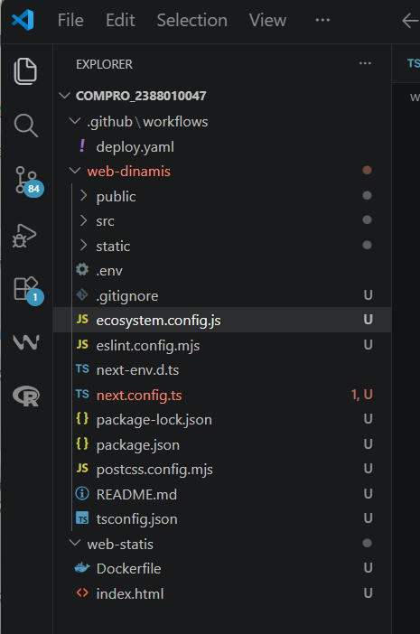
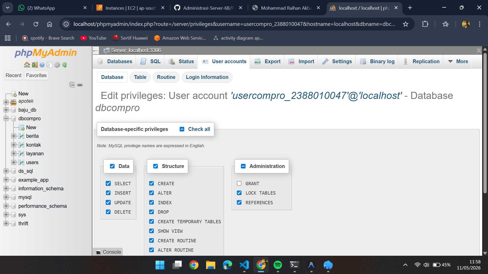
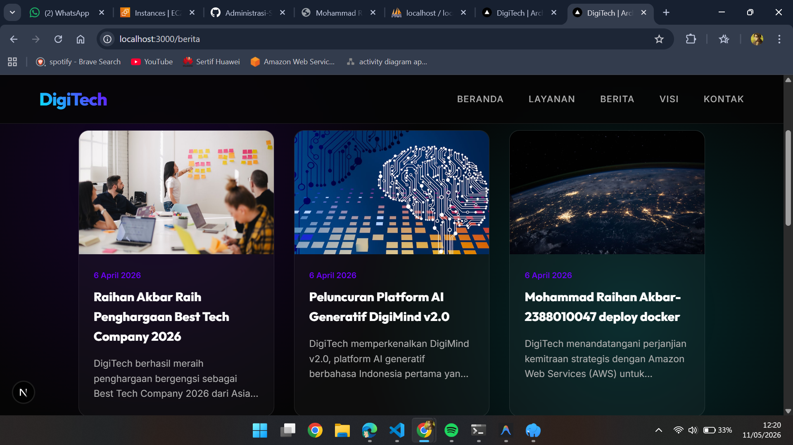

# deploy Multi apps ci/cd docker

1. start instance aws
2. patching os
3. hapus layanan apache2 dan unisntall -> sudo apt remove apache2
4. check docker ps -la dan docker start compro_2388010047
4. Hpus layanan Mariadb dan unisntall -> sudo systemctl stop mariadb && sudo systemctl disable mariadb
    sudo apt remove mariadb-server mariadb-client mariadb-common
5. Testing Next.js + db menggunakan user bukan root pada local env 
    - copy project digitech pada ptm6 kecuali folder .next, node_modules, sql kedalam folder web-dinamis
    

    - buat usercompro_2388010047 set jadi localhost pw= 12345
    

    - sesuaikan isi file .env di folder compro_2388010047 username sama pw databasenya
    - open terminal cd web-dinamis
    - npm i
    - npm run dev
    