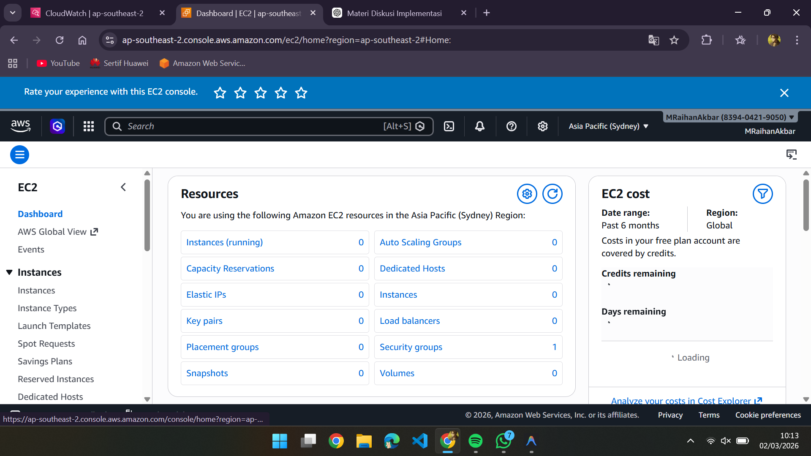
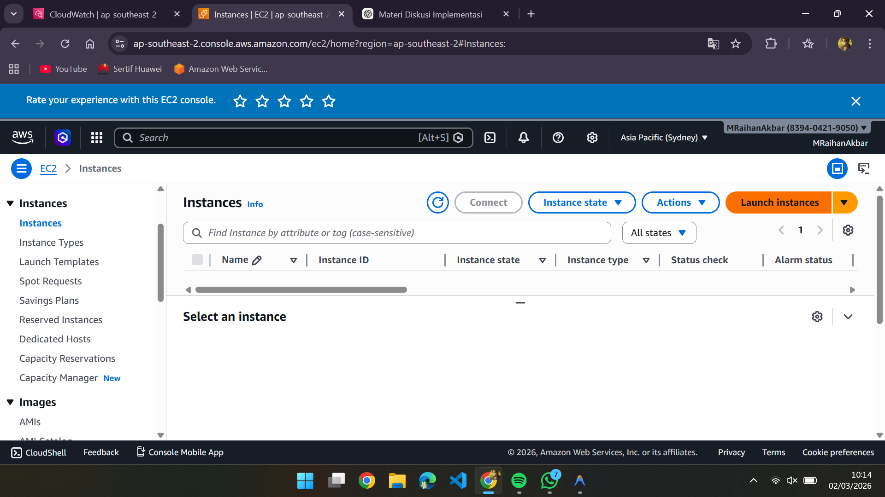
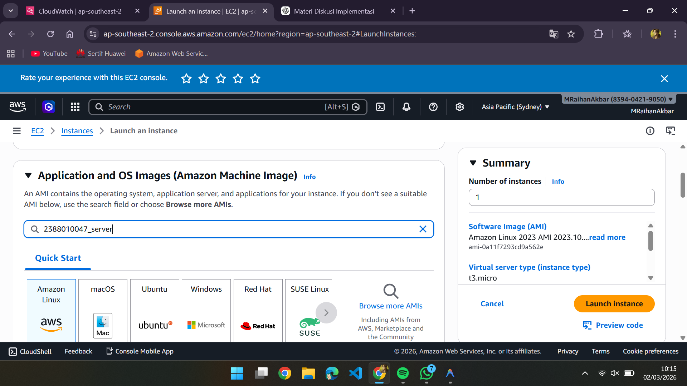
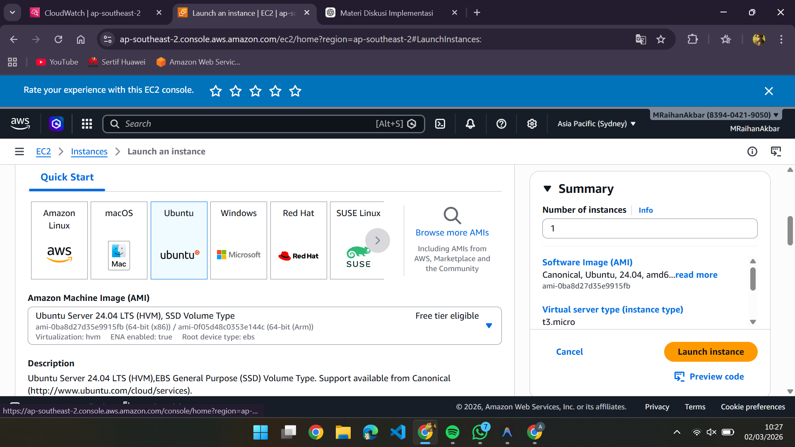
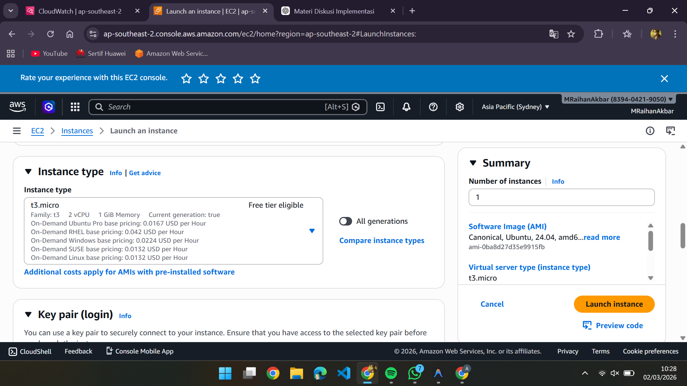
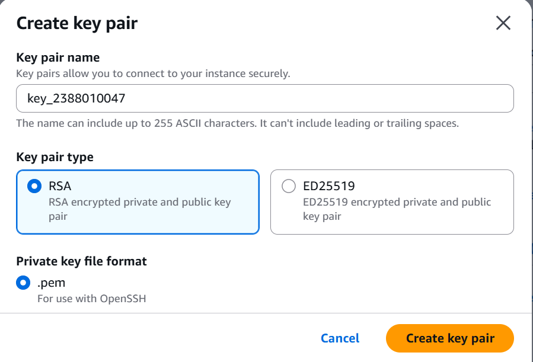
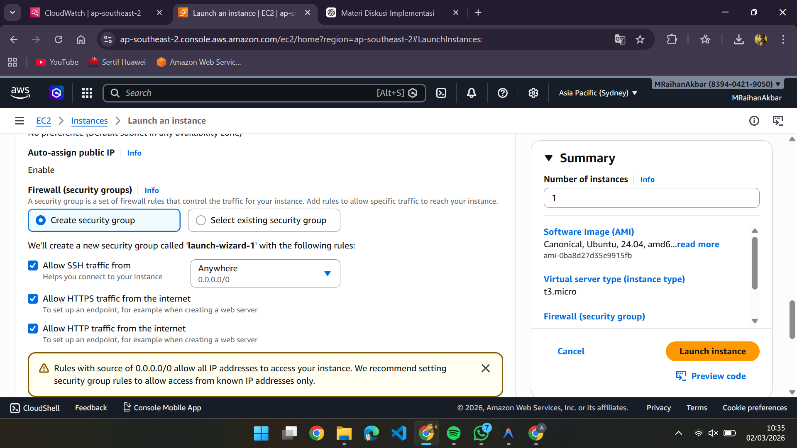
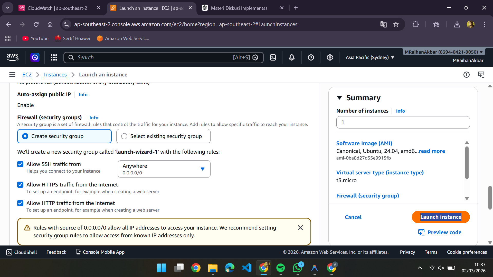
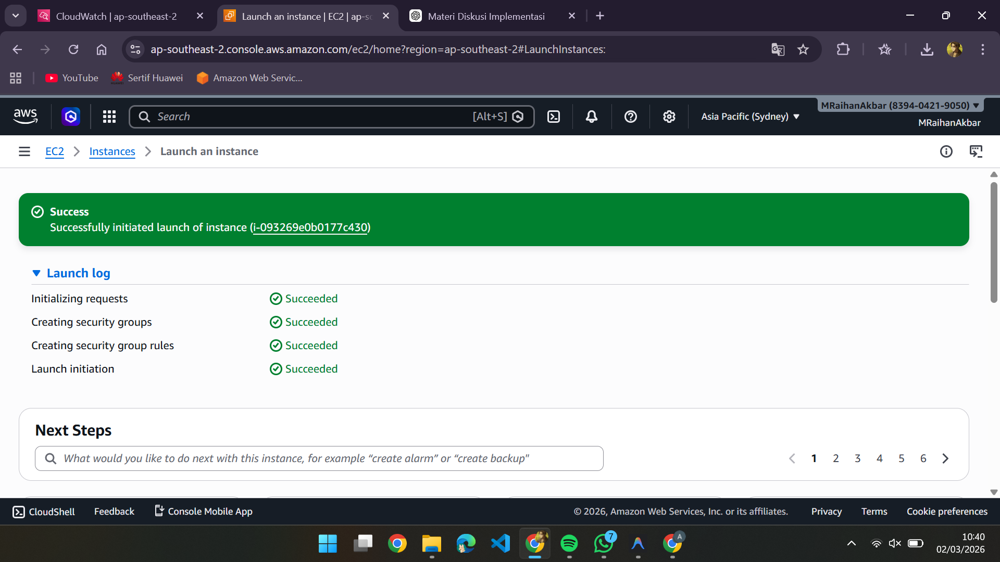

### membuat ec2 /instance/vm

1. Pilih menu allservices kemudian pilihh ec2

    

2. Pilih bagian instance didalam ec2

   
3. Pilih menu launch instance

   
4. Beri nama instance dengan NIM_Server

   
5. kita pilih os server untuk instance kita

   
6. pilih resource instance yg t3.micro

   
7. Membuat key pair, pilih new key pair, isi nama key, pake RSA, format file .pem, create key pair

   
8. setting kebijakan keamanan/ security group

   - allow SSH -> artinya membolehkan remote ssh dari luar
   - allow https -> artinya instance bisa di akses di protocol https
   - allow http -> artinya instance bisa di akses di protocol HTTP

     
9. selesai set up klik launch instance

   
10. pastikan launch instance

    
