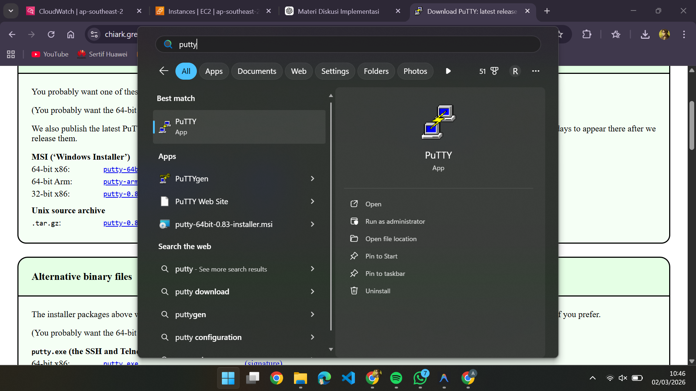
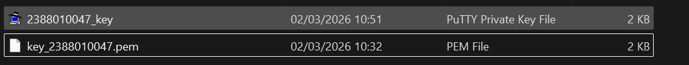
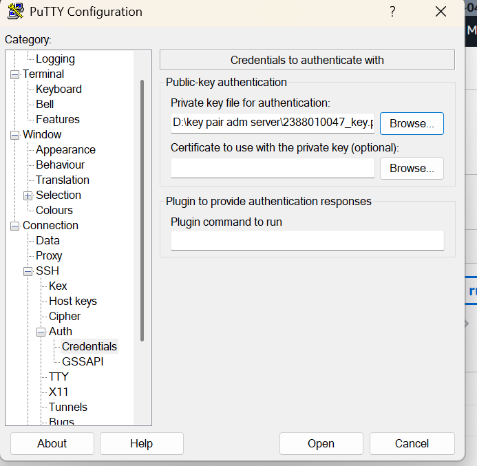
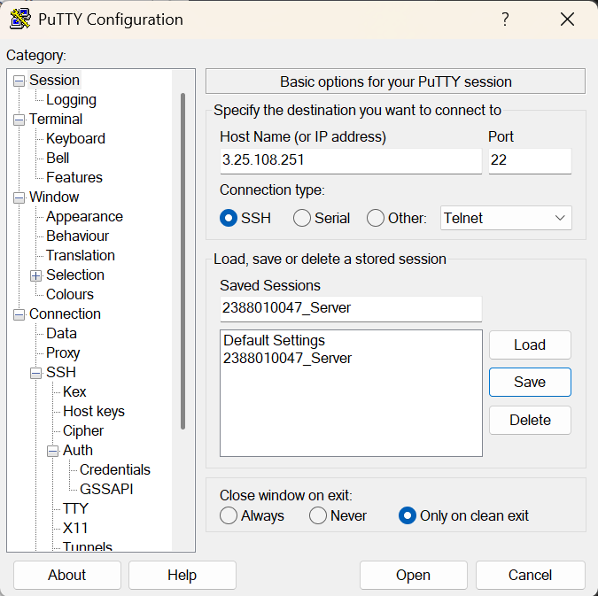
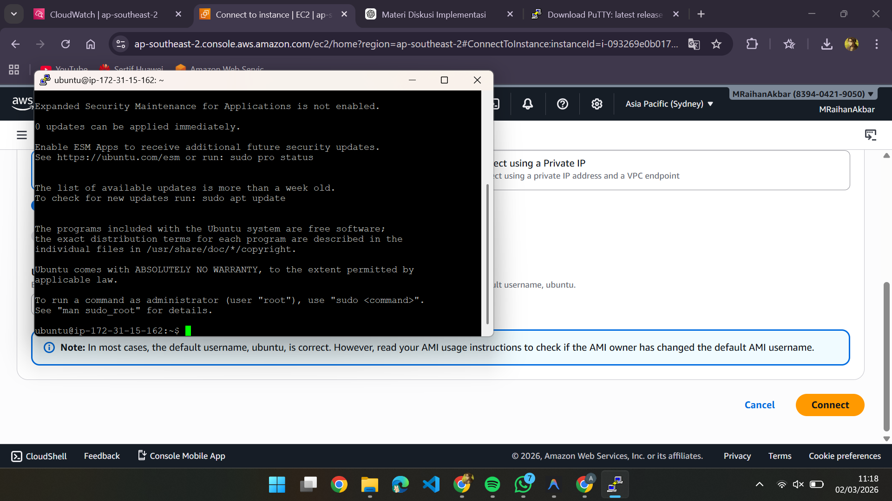
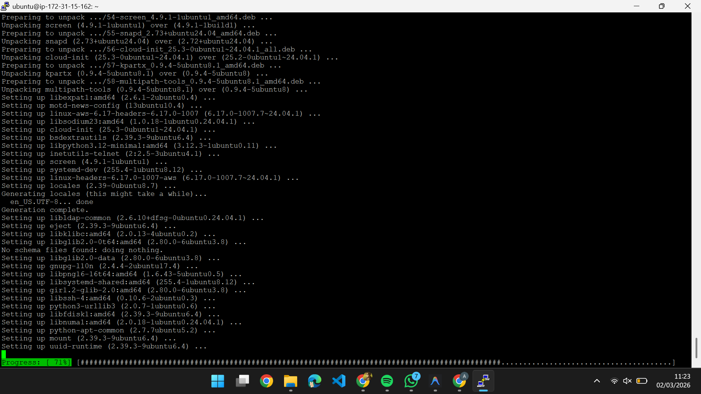
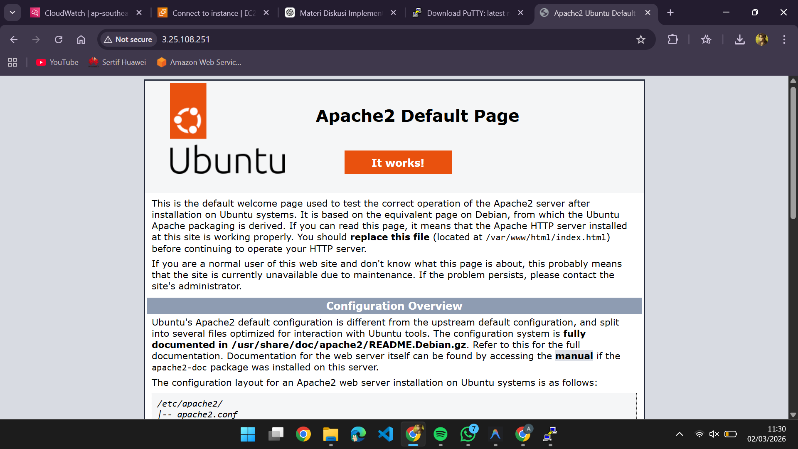
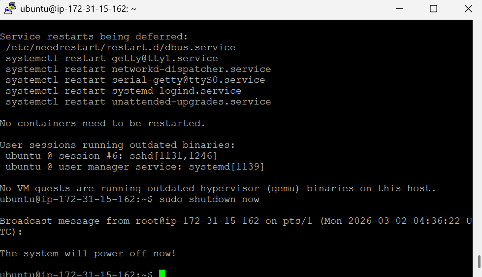
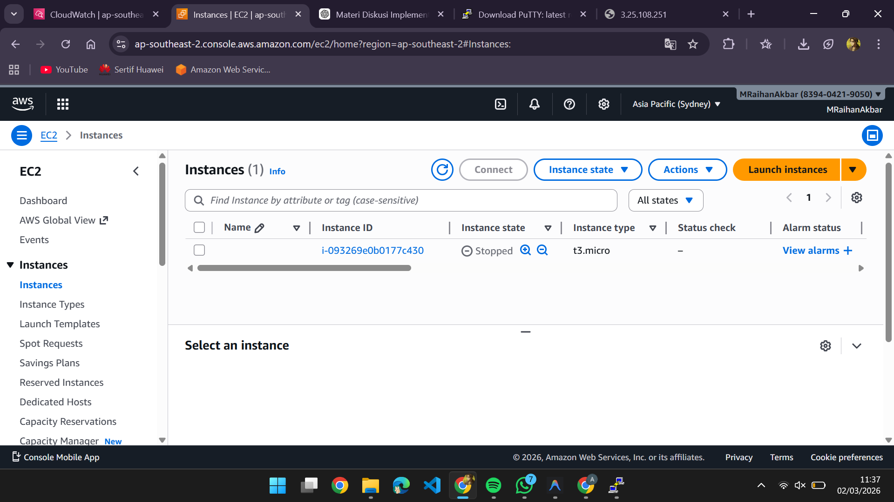

### Remote instance with putty

1. pastikan putty terinstall di pc

   
2. konversi file Public key ari .pem menjadi .ppk di putty

   - buka puttygen
   - load
   - save as .ppk

     
3. set up putty untuk remote SSH

   - buka apps putty
   - isi IP public
   - isi port untuk SSH sesuai security group di instance
   - isi nama session agar saat connect lagi tinggal load saja
   - load file .ppk (di dalam putty)  (klik SSH -> AUTH -> CREDNDTIALS -> load .ppk)

     
   - 
4. connect ubuntu di aws ke putty

   
5. sudo apt get-update, sudo apt upgrade

   
6. pembuktian remote SSH secara visual

   - install webserver sprti apache/nginx

     - sudo apt install apache2 -y

     
7. Matikan instance agar tidak mengurahi saldo di aws //sudo shutdown now

   

   
