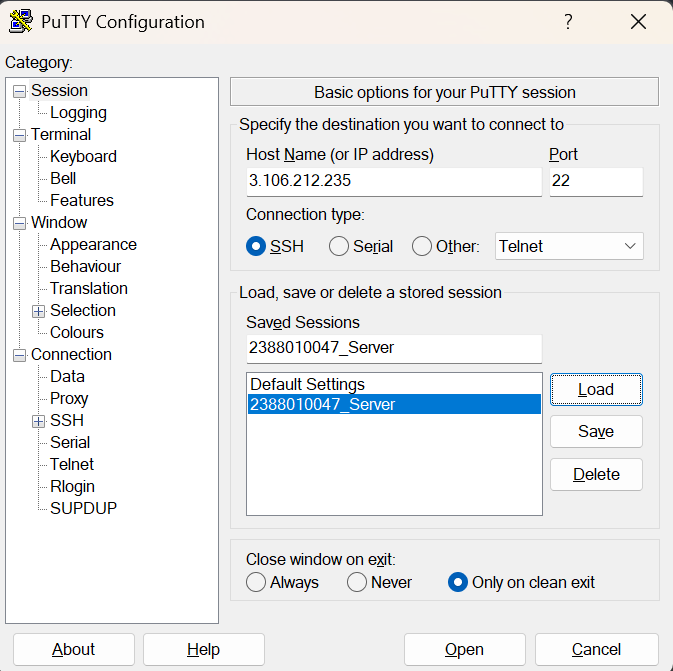
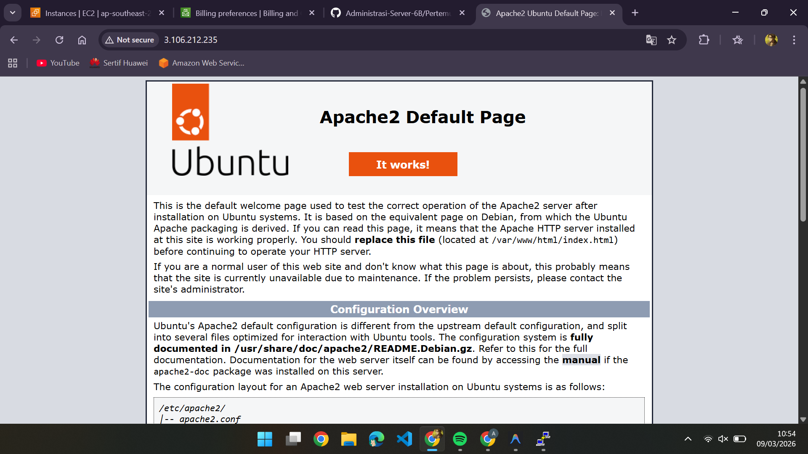
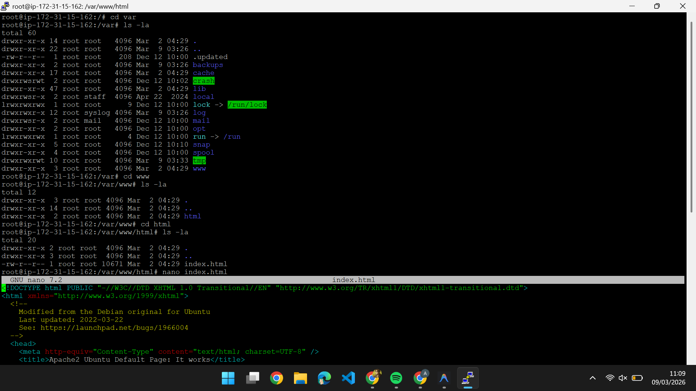
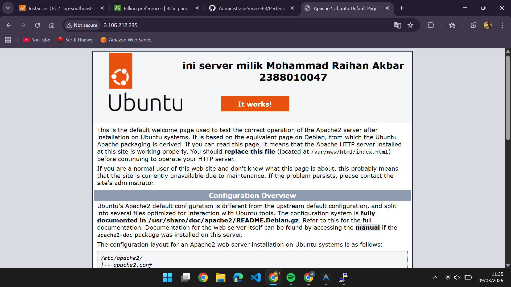

### Implementasi beberapa command line linux

1. start instance
2. buka putty
3. update ip address
   
4. sudo apt update dan sudo apt upgrade untuk paching ubuntu kita
5. open web apache2

   
6. masukkan command

   - sudo su (untuk ke root)
   - lalu ke cd../.. (pergi ke #)
   - ke cd var/www/html
   - ls -la (untuk melihat directory tempat cursor aktif)

     
   - lalu ketik nano index.html (untuk custom nama dan NIM atau apapunnn)
     ini tampilannya

     
