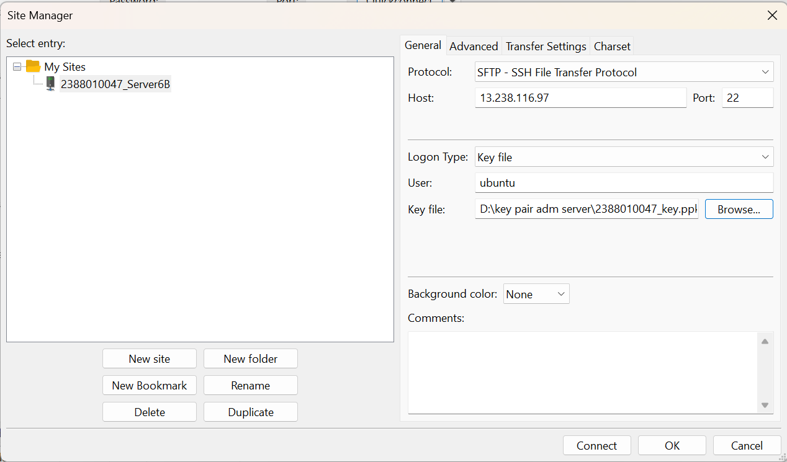
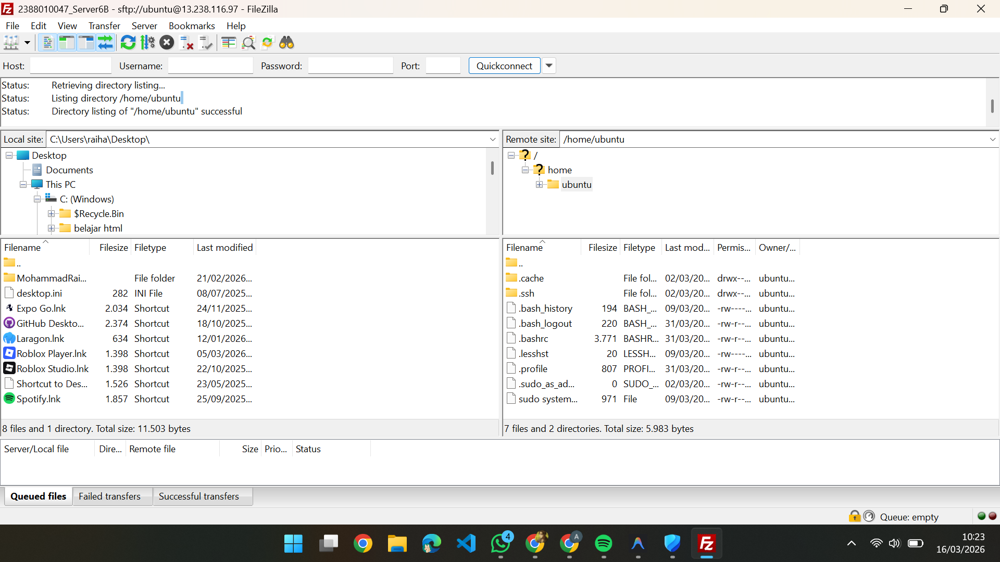
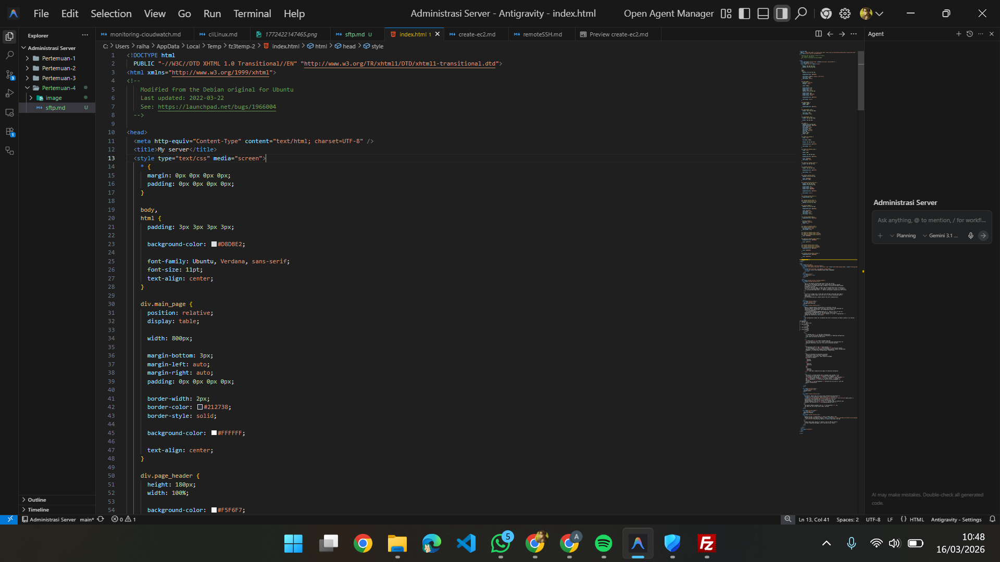
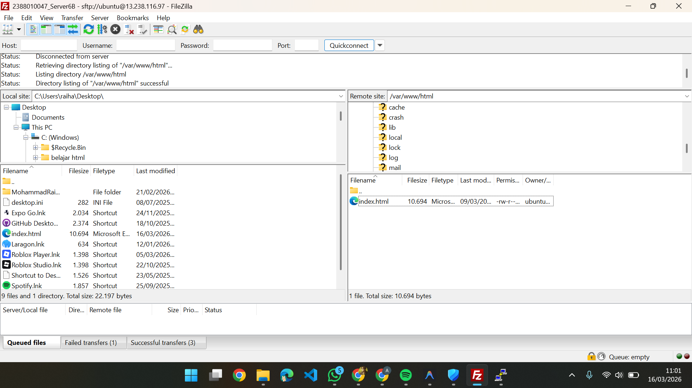

# migrasi file local ke cloud server (aws ec2)

1. memlihin tools migrasi file, misal kita akan gunakan filezilla

   - unduh dan install di https://filezilla-project.org/download.php?type=client
   - buka filezilla client
   - aktifkan instance di aws
   - kembali ke filezilla
   - lalu klik file> site manager > new site
   - protocol> SFTP
   - host > IP Public
   - port > 22
   - logon type > key file
   - user ketik : ubuntu
   - key > cari kunci di D
   - klik connect
   - Lalu OK
   - 
2. Pada Dashboard utama filezilla

   - panel kkanan itu server ubuntu
   - panael kiri itu local
   - 
3. Arahkan directory cloud (panel kanan) ke folder web services area

   - var/www/html
   - masukkan index.html ke text editor
   - 
4. Cara menangani permission untuk edit code

   - masuk ke putty aktifkan
   - ubah kepemilikan folder /var/www/html
   - sintaks sudo chown -R ubuntu:ubuntu var/www/html
   - 
5. Ubahh tampilan Htmlnya bebas

   
