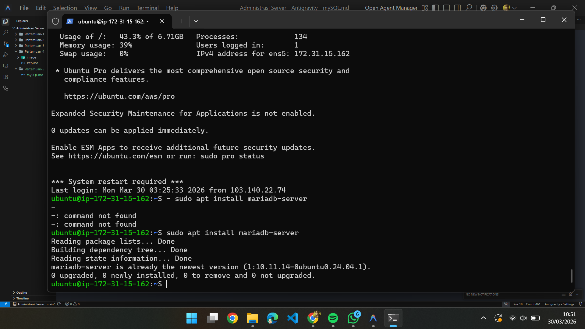
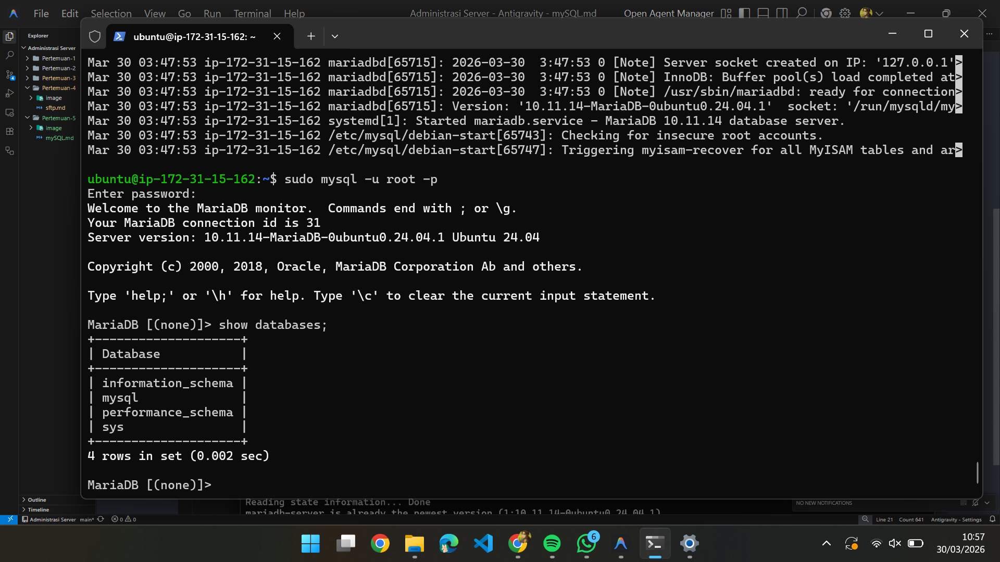
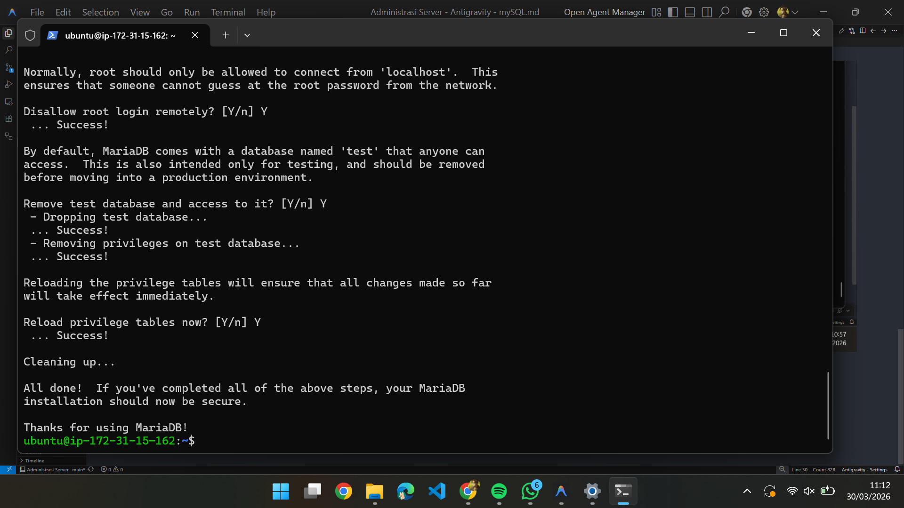
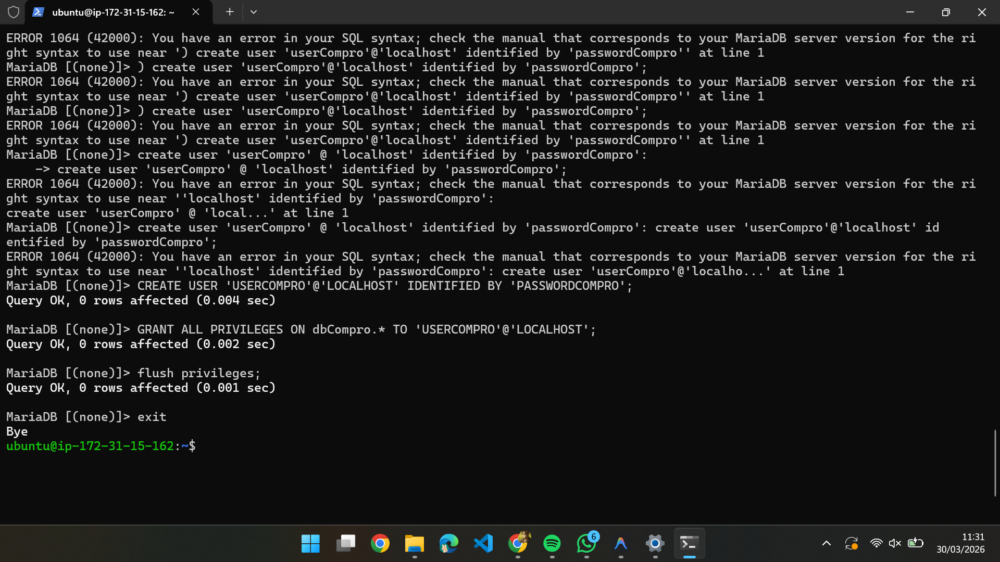
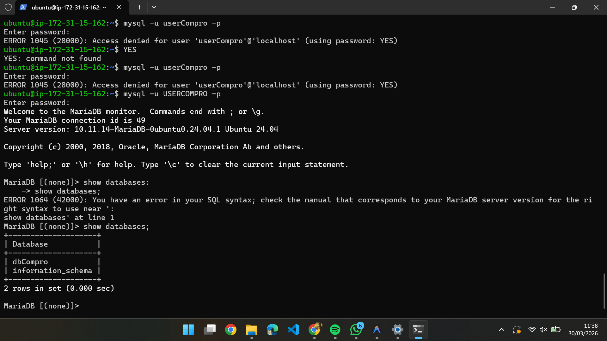

# Membuat database di mysql

1. ## nyalakan instance
2. remote ssh vi terminal
   ----------------------

   - masuk ke folder penyimpanan private key aws buka dengan ctrl shift agar administrator powershell
   - masukkan command ssh -i key privatekita ubuntu@ (ip addresss)
   - tekan enter
3. ## Lakukan patching os

   - sudo apt update
   - sudo apt upgrade -y
4. ## Install maria db

   - sudo apt install mariadb-server
   - sudo systemctl status mariadb
   - coba apakah default setting yg berlaku (sudo mysql -u root -p)
   - cek apakah masih ada database dummy (show databases;)
   - 
   - 
   - tekan exit
5. kita lakukan hardening security

   - Masukkan commad (sudo mysql_secure_installation)
   - buat passowrd kuatt
   - 
6. Buat database dan user

   - membuat  database untuk web company profile (create database dbCompro;)
   - membuat user untuk web company profile (create user 'userCompro'@'localhost' identified by 'passwordCompro';) uppercase
   - memberikan hak akses user untuk web company profile (grant all privileges on dbCompro. *to 'userCompro'@'localhost';) uppercase kecuali dbCompro
   - flush privilege (flush privileges:)
   - keluar dari mysql (exit)
   - 
7. Login sebagai user baru

   - masukkan command (mysql -u USERCOMPRO -p)
   - -Masukkan Password USERCOMPRO (PASSWORDCOMPRO)
   - Cek database dbCompro sudah ada (show databases;)
   - 
