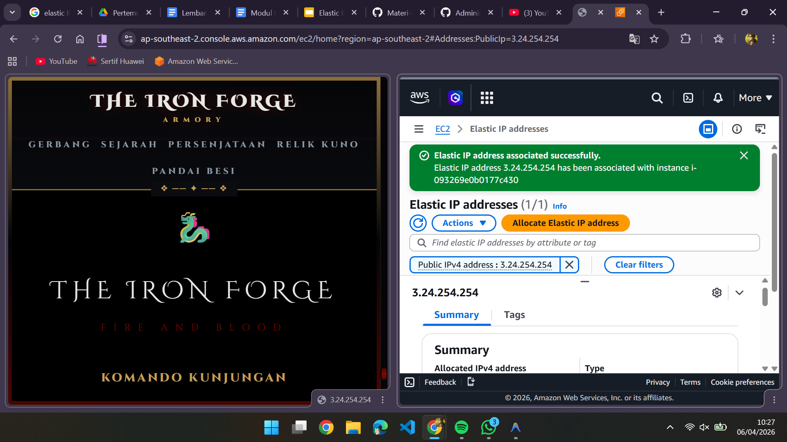

# membuat EIP elastic IP

1. nyalakan instance
2. ke menu Elastic Ip
    - klik allocate ellastic ip address
    - pilih  pool amazon's pool of IPv4 addresses
    - berikan tags
    - klik allocate

4. Associatekan ke instance
    - resource type pilih instances
    - masukkan id instance
    - pilih private ip address
    - klik associate

    