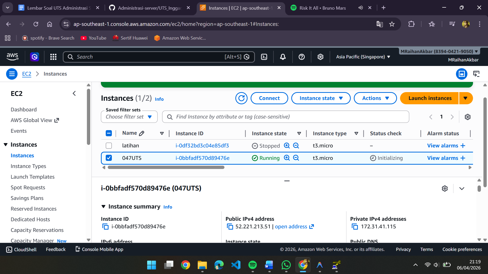
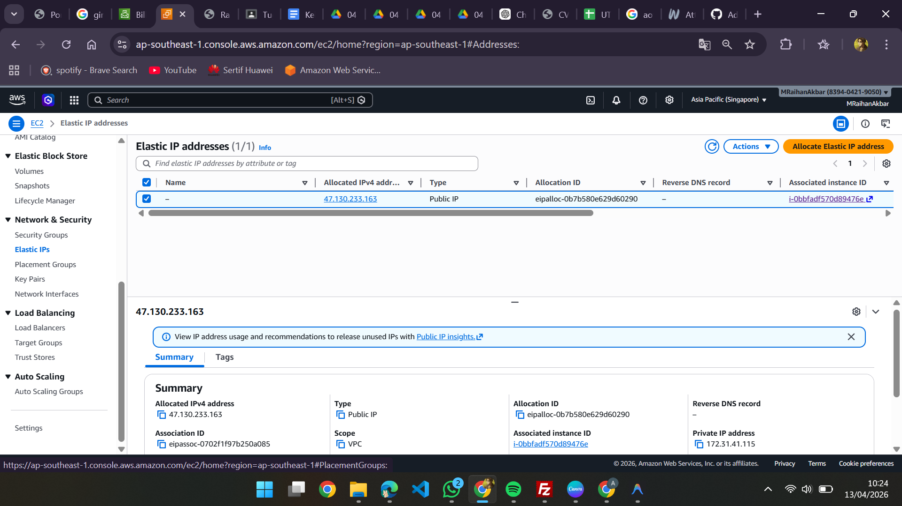
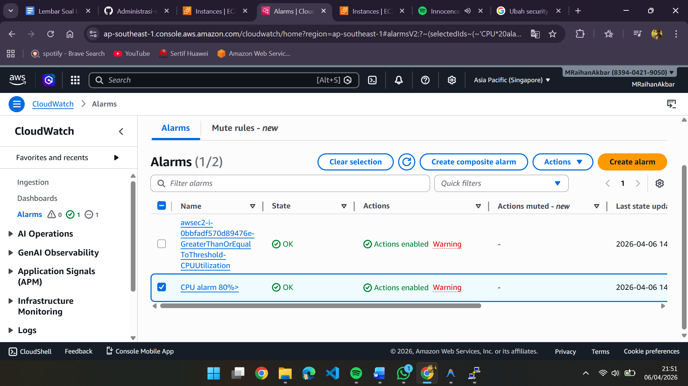
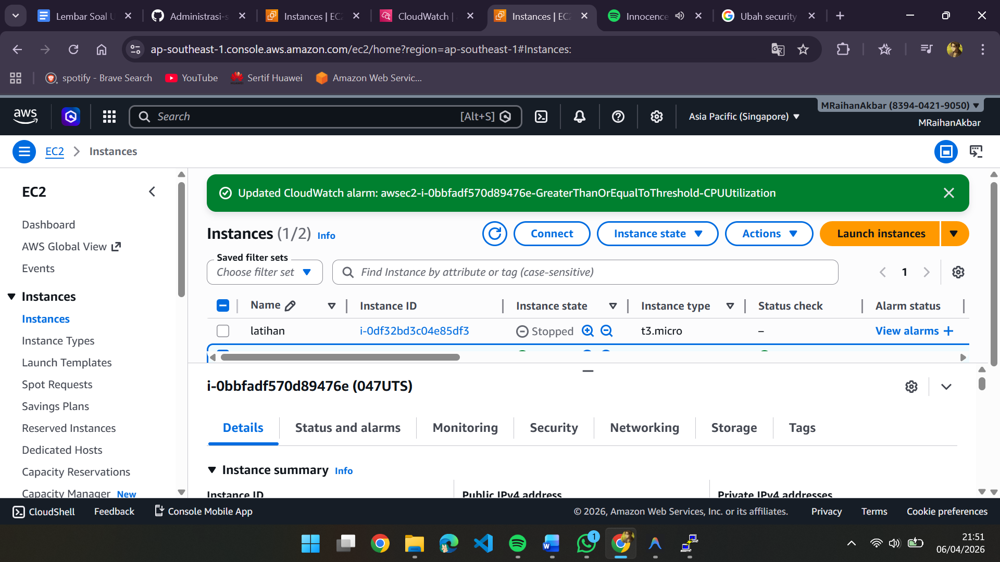
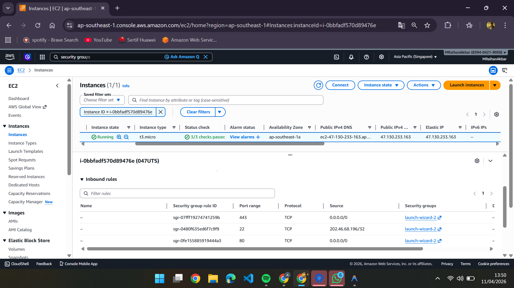
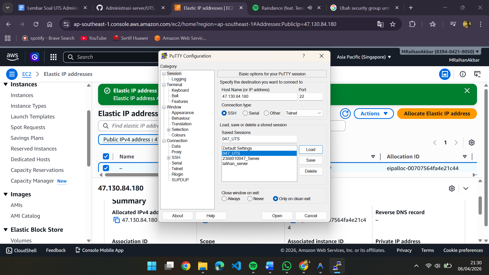
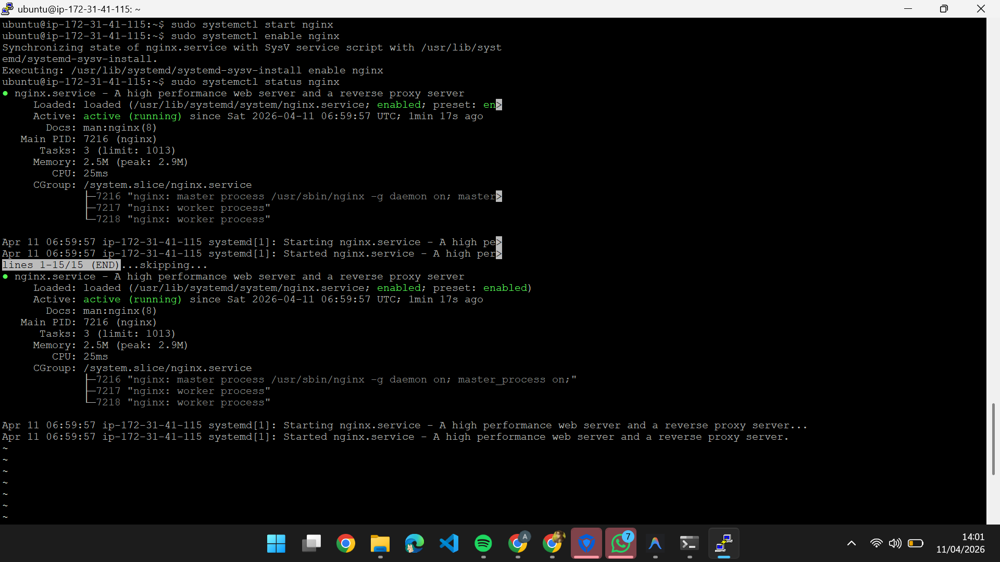
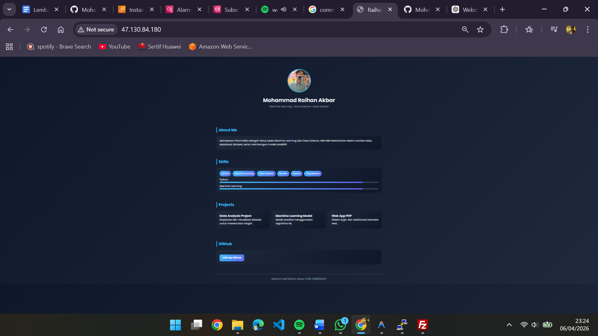

# UTS Administrasi Server

## Raihan Akbar

### 1. Buat instance baru di region Singapore

### 2. buat EIP dan sambungkan ke instance

### 3. cloudwatch alarm 80% CPU

### 4. buat security group

### 5. Remote SSH

### 6. Install web server (Nginx)

### 7. Hasil WEB CV nya

